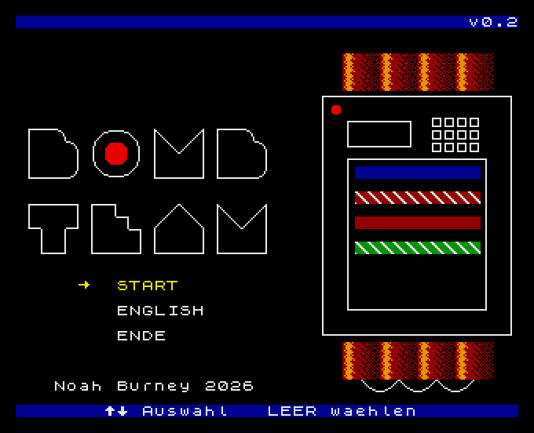
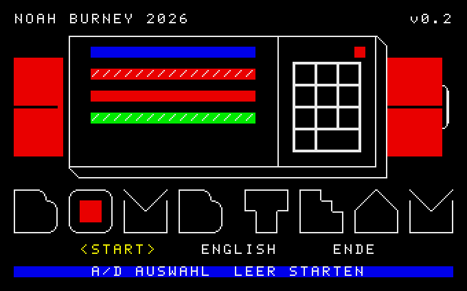

# Bomb Team — KC 85/3, KC 85/4 and the Z9001 (KC 85/1)

A port of my Atari BASIC 10Liner entry, *Bomb Squad*, to the KC 85.

Beep... beep... beep.  Consult the Bomb Defusal Manual, find the page that
matches the bomb on the right of the screen, and cut its wires in the right
order before the countdown runs out.

## KC 85/3 and /4

## Z 9001 (color required)

## Controls

| Action             | Keys                          |
|--------------------|-------------------------------|
| Choose a menu item | cursor up/down, `W` / `S`     |
| Flip the page      | cursor left/right, `A` / `D`  |
| Choose a wire      | cursor up/down, `W` / `S`     |
| Cut, or choose     | `SPACE` or `ENTER`            |
| Type your name     | letters; `DEL` erases, `ENTER` accepts |
